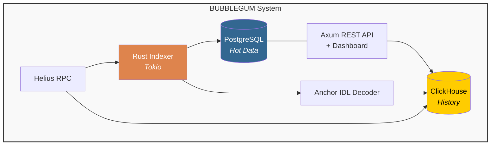

# Bubblegum, a Production Grade Solana Program Indexer

I present to you Bubblegum, a production-grade Solana Program Indexer written in Rust. Decodes Anchor program
transactions using the program's `IDL` then stores them in a dual-database architecture(hot and cold storage),
and exposes a REST API with a UI for exploration and analytics.

---

## Architecture



| Component     | Technology                     | Role                          |
|---------------|-------------------------------|-------------------------------|
| Indexer       | Rust / Tokio                  | Core loop, decoding, storage  |
| RPC           | Helius enhanced Solana RPC    | Transaction & slot fetching   |
| IDL Decoder   | Borsh + Anchor discriminators | Instruction argument decoding |
| Hot DB        | PostgreSQL 16                 | Recent txs, fast lookups      |
| Cold DB       | ClickHouse 23                 | Historical data, analytics    |
| API           | Axum 0.7                      | REST endpoints + static files |
| Dashboard     | Vanilla HTML/CSS/JS           | UI + SQL tool       |

---

## Prerequisites

- [Docker](https://docs.docker.com/get-docker/) and [Docker Compose](https://docs.docker.com/compose/) v2+
- A [Helius](https://helius.dev) API key 
- The public key of the Solana Anchor program you want to index
- Optionally, you can use the program's IDL JSON file if you don't want on-chain fetch

---

## Getting Started

```bash
# 1. Clone the repo
git clone https://github.com/carsonpine/bubblegum
cd bubblegum

# 2. Configure environment
cp .env.example .env
# Edit .env then set HELIUS_RPC_URL and PROGRAM_ID (MUST)

# 3. Launch everything
docker compose up

# See the UI at Dashboard: http://localhost:3000
```

That's it. One command. All services start with health checks, the indexer waits
for both databases to be ready, then begins indexing.

---

## Configuration

All configuration is via environment variables (`.env` file or Docker Compose env).

| Variable             | Required | Default          | Description                                             |
|----------------------|----------|------------------|---------------------------------------------------------|
| `HELIUS_RPC_URL`     | ✅       | —                | Helius RPC URL with your API key                        |
| `PROGRAM_ID`         | ✅       | —                | Solana program public key (base58) to index             |
| `POSTGRES_URL`       | ✅       | —                | PostgreSQL connection string                            |
| `CLICKHOUSE_URL`     | ✅       | —                | ClickHouse HTTP URL                                     |
| `CLICKHOUSE_USER`    | ❌       | `default`        | ClickHouse username                                     |
| `CLICKHOUSE_PASSWORD`| ❌       | *(empty)*        | ClickHouse password                                     |
| `START_SLOT`         | ❌       | current slot     | Starting slot; resumes from checkpoint if one exists    |
| `END_SLOT`           | ❌       | *(runs forever)* | Stop indexing at this slot                              |
| `BATCH_SIZE`         | ❌       | `100`            | Transactions per processing batch                       |
| `IDL_PATH`           | ❌       | *(on-chain)*     | Path to local IDL JSON file; omit to fetch from chain   |
| `API_PORT`           | ❌       | `3000`           | REST API and dashboard port                             |

---

## API Documentation

Base URL: `http://localhost:3000`

### `GET /transaction/:signature`

Fetch a single decoded transaction by its signature.

```bash
curl http://localhost:3000/transaction/5KtPn3Dxyz...
```

Response:
```json
{
  "signature": "5KtPn3D...",
  "slot": 200001234,
  "timestamp": 1700000000,
  "program_id": "YourProgramId...",
  "instruction_name": "swap",
  "instruction": {
    "amount_in": "1000000",
    "minimum_amount_out": "990000"
  },
  "signer": "UserPubkey...",
  "accounts": [
    { "pubkey": "...", "is_signer": true, "is_writable": true },
    { "pubkey": "...", "is_signer": false, "is_writable": true }
  ]
}
```

### `GET /transactions`

List decoded transactions with optional filters.

Query parameters:

| Parameter      | Type   | Description                         |
|----------------|--------|-------------------------------------|
| `instruction`  | string | Filter by instruction name          |
| `signer`       | string | Filter by signer pubkey             |
| `start_slot`   | number | Minimum slot                        |
| `end_slot`     | number | Maximum slot                        |
| `limit`        | number | Results per page (default 50, max 500) |
| `offset`       | number | Pagination offset                   |

```bash
# All transactions
curl http://localhost:3000/transactions

# Filter by instruction
curl "http://localhost:3000/transactions?instruction=swap&limit=50"

# Filter by signer with slot range
curl "http://localhost:3000/transactions?signer=UserPubkey...&start_slot=200000000&end_slot=200001000"

# Paginate
curl "http://localhost:3000/transactions?limit=50&offset=100"
```

### `GET /stats`

Returns aggregate stats from both databases.

```bash
curl http://localhost:3000/stats
```

```json
{
  "postgres": {
    "total_transactions": 15432,
    "last_indexed_slot": 200001234,
    "checkpoint_slot": 200001234,
    "programs_indexed": 1
  },
  "clickhouse_total": 15432
}
```

### `POST /api/sql`

Execute a read-only SQL query against PostgreSQL or ClickHouse(in development).

```bash
curl -X POST http://localhost:3000/api/sql \
  -H "Content-Type: application/json" \
  -d '{
    "db": "postgres",
    "sql": "SELECT instruction_name, COUNT(*) FROM transactions GROUP BY instruction_name ORDER BY count DESC"
  }'
```

```json
{
  "columns": ["instruction_name", "count"],
  "rows": [
    { "instruction_name": "swap", "count": "9821" },
    { "instruction_name": "deposit", "count": "3204" }
  ],
  "row_count": 2,
  "execution_time_ms": 12
}
```

### `GET /health`

Health check endpoint.

```bash
curl http://localhost:3000/health
# { "status": "ok", "service": "bubblegum-indexer" }
```

---

## Dashboard

Open `http://localhost:3000` after starting the stack.

**Transactions tab:**
- Filterable, paginated transaction table with sortable columns
- Click any row to open a full detail modal with decoded args and accounts
- Export filtered results to CSV
- Auto-refreshes every 5 seconds

**SQL Query Tool:**
- Write raw SQL against PostgreSQL or ClickHouse
- 8 prebuilt analytics queries (instruction counts, top signers, daily volumes, etc.)
- Query history stored in localStorage
- Export results to JSON
- Keyboard shortcut: `Ctrl+Enter` / `Cmd+Enter` to run

---

## Testing

### Verify databases are up

```bash
# PostgreSQL
docker compose exec postgres psql -U indexer -d solana_indexer -c "SELECT COUNT(*) FROM transactions;"

# ClickHouse
docker compose exec clickhouse clickhouse-client --user indexer \
  --query "SELECT count() FROM solana_indexer.transactions_history;"
```

### Test the API

```bash
# Health
curl http://localhost:3000/health

# Stats
curl http://localhost:3000/api/stats

# Transactions
curl "http://localhost:3000/api/transactions?limit=5"

# Known transaction (replace with a real signature after indexing)
curl http://localhost:3000/api/transaction/SIGNATURE_HERE
```

### Run with a local IDL file

```bash
# Export IDL from your Anchor project
anchor idl fetch YOUR_PROGRAM_ID --provider.cluster mainnet -o idl.json

# Set in .env
IDL_PATH=/path/to/idl.json

docker compose up --build
```

---

## Troubleshooting

**Indexer exits immediately with "Failed to load Anchor IDL"**
- If using on-chain IDL: your program may not have published an IDL. Export it manually and set `IDL_PATH`.
- If using a file: verify the path is correct and the JSON is valid Anchor IDL.

**RPC errors / rate limit warnings**
- The free Helius tier supports 10 RPS. If you're seeing rate limit errors, consider upgrading your plan.

**No transactions appearing**
- Confirm `PROGRAM_ID` is the correct base58 public key.
- Check `START_SLOT` / `END_SLOT` — try a narrow recent range first.
- Run `curl http://localhost:3000/stats` to see if the checkpoint is advancing.

**ClickHouse fails to start**
- Increase Docker memory limits (ClickHouse needs at least 2 GB).
- Check logs: `docker compose logs clickhouse`

**PostgreSQL connection refused**
- Ensure the indexer service waits for the `service_healthy` condition.
- Run `docker compose ps` to verify postgres is healthy before the indexer starts.

**Dashboard shows "—" for all stats**
- The indexer may still be starting up. Wait a few seconds and refresh.
- Check `docker compose logs indexer` for startup errors.

---

## Project Structure

```
bubblegum/
├── Cargo.toml              Rust dependencies
├── Dockerfile              Multi-stage production build
├── docker-compose.yml      Full stack orchestration
├── .env.example            Environment variable reference
├── init.sql                PostgreSQL schema + indexes
├── init_ch.sql             ClickHouse schema + materialized views
├── src/
│   ├── main.rs             Entrypoint, wires all components
│   ├── config.rs           Environment config with validation
│   ├── idl.rs              Anchor IDL parser (file + on-chain)
│   ├── rpc.rs              Helius RPC client (rate limit + retry)
│   ├── decoder.rs          Borsh instruction decoder
│   ├── indexer.rs          Main indexing loop + checkpoint
│   ├── api.rs              Axum REST API + SQL tool
│   └── db/
│       ├── mod.rs
│       ├── postgres.rs     sqlx PostgreSQL layer
│       └── clickhouse.rs   ClickHouse batch insert layer
└── static/
    ├── index.html          Dashboard shell
    ├── style.css           Dark pink theme
    └── app.js              Dashboard logic
```

## BUilt for the [Superteam Ukraine Bounty](https://superteam.fun/earn/listing/build-solana-program-indexer-beginner)
